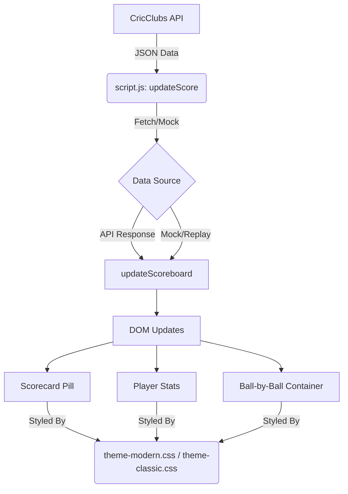

# System Architecture - Topguns Stream Overlay

The Topguns Stream Overlay is a lightweight, client-side web application designed to display real-time cricket scores during live broadcasts. It leverages the CricClubs API to fetch data and provides a customizable UI through a modular CSS theming system.

## Project Structure

```text
topguns-stream-overlay/
├── assets/             # Static assets (images, logos)
├── css/                # Visual themes
│   ├── theme-classic.css # Traditional broadcast look
│   └── theme-modern.css  # Modern, glassmorphism design
├── js/                 # Application logic and data
│   ├── mockData.js     # Static match states for debugging
│   ├── replayData.js   # Sequence of states for replay mode
│   └── script.js       # Core application engine
├── index.html          # Application entry point & DOM structure
├── architecture.md     # This document
└── README.md           # Quick start and configuration guide
```

## Core Components

### 1. Data Polling Engine
Located in `js/script.js`, the engine uses `setInterval` to periodically fetch match data.
- **Refresh Rate**: Default is 5000ms (configurable in `CONFIG`).
- **Fetch Logic**: Uses the `fetch` API to retrieve JSON from the CricClubs live score endpoint.

### 2. State Management & DOM Updates
- **DOM Mapping**: The `DOM` constant in `script.js` maps HTML IDs to JavaScript variables for efficient updates.
- **Normalization**: The `updateScoreboard` function processes raw API data and updates text content, visibility, and styles.
- **Ball-by-Ball Tracking**: `updateBallByBall` manages the history of the current over, injecting dynamic "pop-in" indicators for each delivery.

### 3. Theming System
- **Dynamic CSS**: Themes are applied by switching the `href` of the `#theme-stylesheet` link tag based on the `theme` URL parameter.
- **CSS Variables**: Themes use CSS custom properties (`:root`) for colors, shadows, and radii, allowing for easy visual overrides without changing logic.
- **Outcome Styling**: `getBallStyleClass` maps cricket outcomes (Wicket, Wide, 4, 6, etc.) to specific CSS classes, enabling color-coded indicators.

## Data Flow



## Testing & Debugging Modes

The overlay provides several built-in modes for testing and demonstration:

- **Debug Mode**: Uses static exports from `mockData.js` to simulate different match stages (1st Innings, 2nd Innings, Match Ended, Toss).
- **Replay Mode**: Iterates through an array of match states in `replayData.js` to demonstrate transitions and animations.
- **Theme Previews**: Allows switching between `modern` and `classic` themes via URL parameters.

## External Dependencies
- **Google Fonts**: Uses 'Montserrat' for the modern theme and default sans-serif for classic.
- **CricClubs API**: Primary source for live match data.
